# Wolody

## 만든 이유는!?

- Flutter랑 좀 더 친해지고 싶어서 만들었어요. (개인 프로젝트용).
- Wolody는 하루 기분을 기록하는 앱이에요. 감정을 고르고, 짧게 글 쓰고, 사진도 붙일 수 있어요.
- UI는 Apple iOS 26+의 Liquid Glass 느낌으로 만들었어요.

## 기능

- 탭: 홈 | 기록 | 마이 | +
- 계정 로그인 방식: Google · 카카오 로그인
- 감정 선택 + 메모 + 사진으로 오늘 기록 남기기
- 달력으로 지난 기록 보기
- 마이 페이지에서 Wolody 리캡 보기
- 기록 알림(루틴), 라이트/다크 모드
- 홈 화면 위젯, Live Activity (잠금 화면 · 다이나믹 아일랜드). 안드로이드는 Android 16+ Live Update 알림으로 떠요.

### 앱 실행 미리보기 영상
<video controls src="docs/IntroducingVidio.MP4" title="Title" width="200"></video>

<hr>

## In App 와이어프레임

<div align="center">
  <table>
    <tr>
      <td align="center">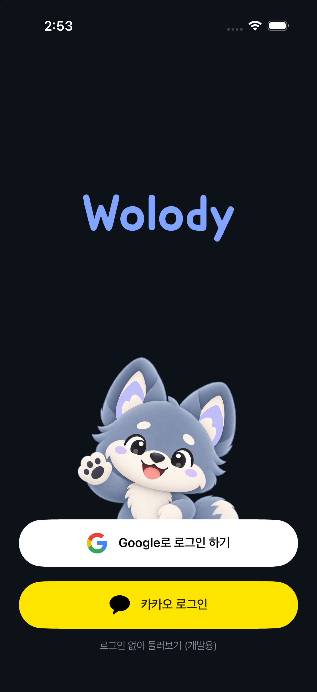<br/><sub>로그인 (Google · 카카오)</sub></td>
      <td align="center">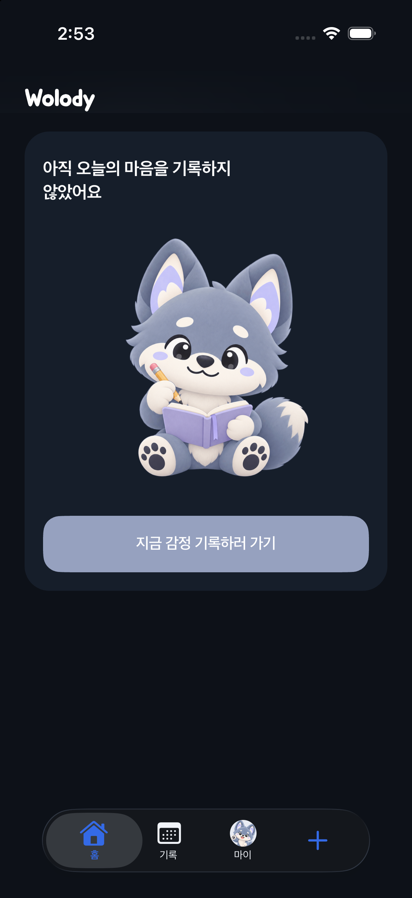<br/><sub>홈 · 기록 전</sub></td>
      <td align="center">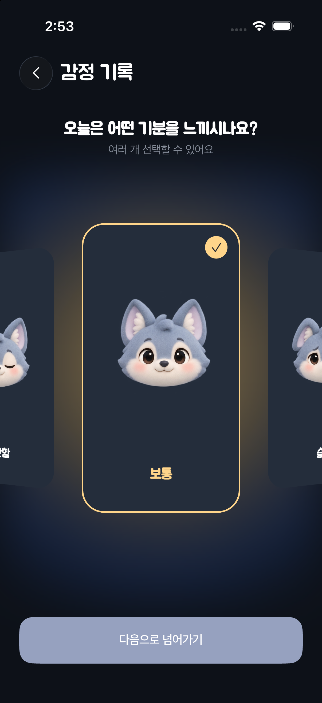<br/><sub>감정 선택</sub></td>
      <td align="center">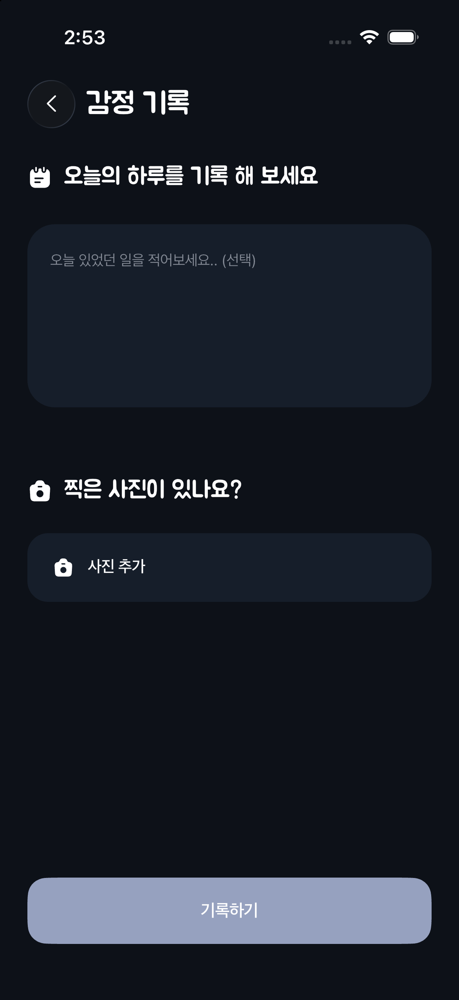<br/><sub>하루 기록 · 사진 추가</sub></td>
    </tr>
    <tr>
      <td align="center">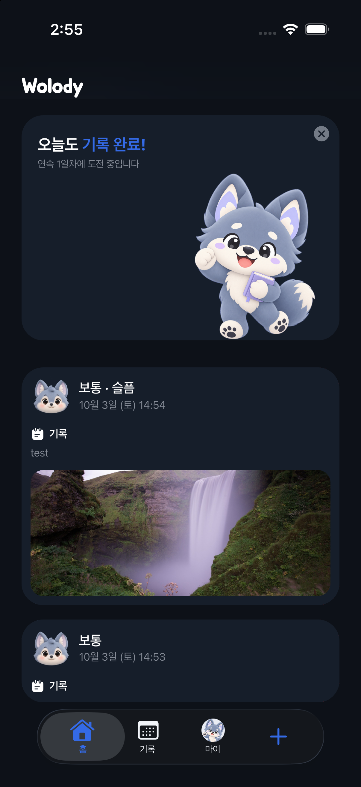<br/><sub>홈 · 기록 완료</sub></td>
      <td align="center">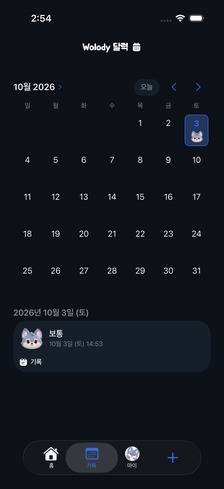<br/><sub>달력</sub></td>
      <td align="center">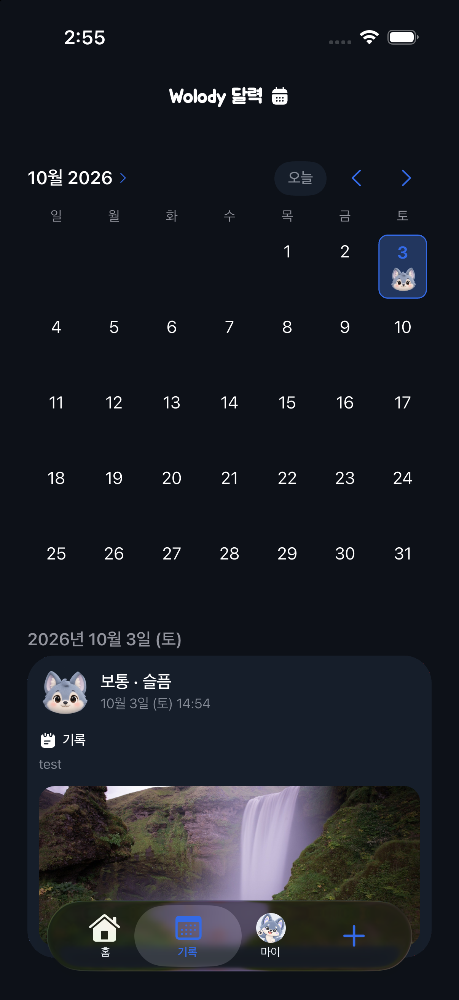<br/><sub>달력 · 기록 상세</sub></td>
      <td align="center">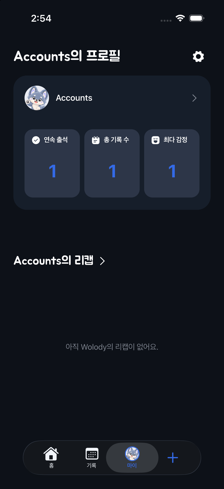<br/><sub>마이 · 리캡 없음</sub></td>
    </tr>
    <tr>
      <td align="center">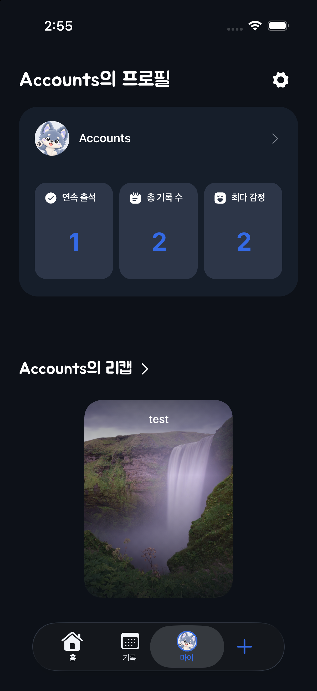<br/><sub>마이 · 리캡</sub></td>
      <td align="center">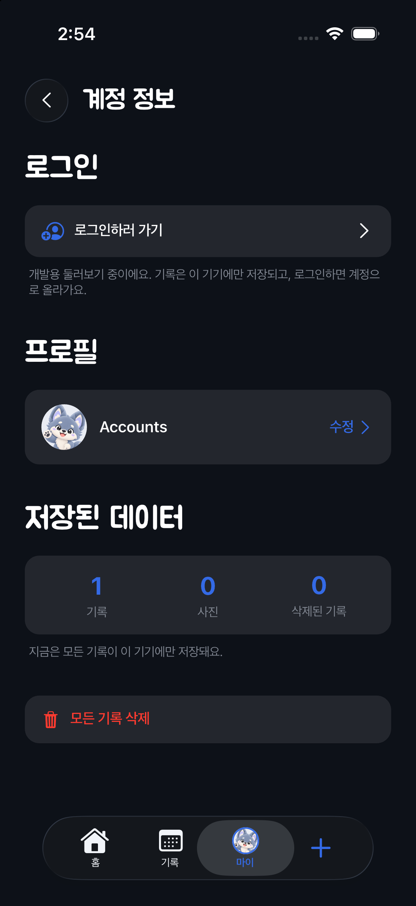<br/><sub>계정 정보 · 저장된 데이터</sub></td>
      <td align="center">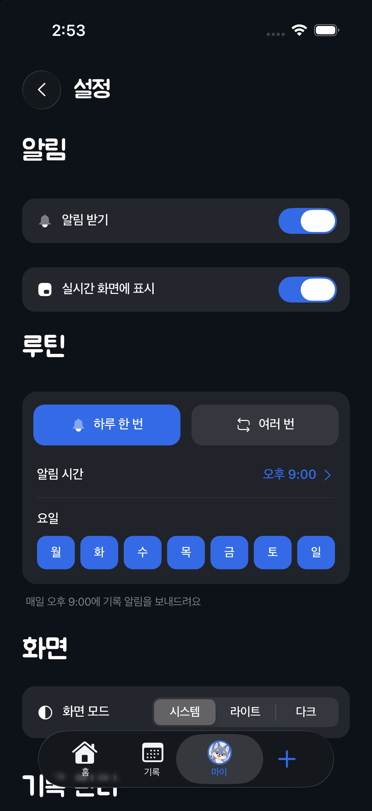<br/><sub>설정 (알림 · 루틴 · 화면 모드)</sub></td>
      <td align="center">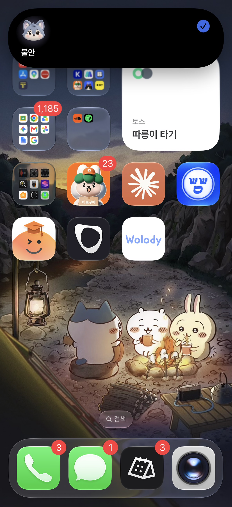<br/><sub>앱 아이콘 &amp; 다이나믹 아일랜드</sub></td>
    </tr>
    <tr>
      <td align="center">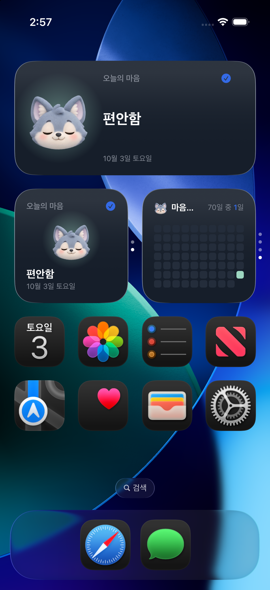<br/><sub>홈 화면 위젯</sub></td>
      <td align="center">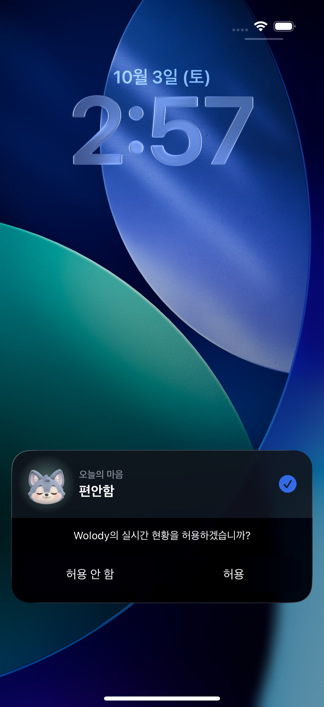<br/><sub>Live Activity 권한 요청</sub></td>
      <td></td>
      <td></td>
    </tr>
  </table>
</div>

- 2026.8.9 처음 작성 (@LINKSHIMCAT)
- 2026.10.3 스크린샷 갱신 (iPhone 17 시뮬레이터, 앱 아이콘 & 다이나믹 아일랜드만 실제 기기)

<hr>

# Getting Started

직접 빌드해 보고 싶으면 아래 순서대로 하면 돼요.

### 필요한 것

- Flutter 3.44 이상 (Dart 3.12 이상) — `pubspec.lock` 기준
- Xcode (iOS 최소 버전 16.1)
- Android Studio / Android SDK (안드로이드로 돌릴 때)

### 1. 패키지 받기

```bash
git clone <이 저장소 주소>
cd wolody
flutter pub get
```

iOS는 CocoaPods 대신 Swift Package Manager로 플러그인을 가져와요(`ios/Podfile` 없음). 그래서 `pod install`은 안 해도 돼요.

### 2. Supabase 준비

로그인, 계정 동기화, 사진 저장에 Supabase를 써요.

1. Supabase에서 프로젝트를 만들어요.
2. SQL Editor에서 `supabase/migrations`의 파일을 순서대로 실행해요. (`0001_init.sql` → `0002_advisor_fixes.sql` → `0003_profiles.sql`)
3. Authentication → URL Configuration의 Redirect URL에 `wolody://login-callback/`을 추가해요.
4. Authentication → Providers에서 Google, Kakao를 켜요.

### 3. 키 넣기

키는 전부 `--dart-define`으로 넘길 수 있어요. 코드에는 지금 쓰는 공개용 값이 기본값으로 들어 있어서, 내 프로젝트로 바꿀 때만 넘기면 돼요. **secret 키나 Client Secret은 절대 넣지 마세요.**

| 이름 | 어디서 받나 |
|---|---|
| `SUPABASE_URL` | Supabase → Settings → API Keys의 Project URL |
| `SUPABASE_ANON_KEY` | 같은 곳의 publishable 키 (`sb_publishable_...`) |
| `GOOGLE_IOS_CLIENT_ID` | Google Cloud Console의 **iOS** OAuth 클라이언트 ID |
| `GOOGLE_WEB_CLIENT_ID` | 같은 곳의 **웹 애플리케이션** OAuth 클라이언트 ID (Supabase Google 설정에도 넣어요) |
| `KAKAO_NATIVE_APP_KEY` | Kakao Developers → 앱 키 → 네이티브 앱 키 |

`--dart-define`만으로는 안 바뀌는 곳이 두 군데 있어서 같이 바꿔야 해요.

- `ios/Flutter/Auth.xcconfig`: `GOOGLE_REVERSED_CLIENT_ID`(iOS 클라이언트 ID를 거꾸로 쓴 값), `KAKAO_NATIVE_APP_KEY`
- `android/app/build.gradle.kts`: `manifestPlaceholders["kakaoNativeAppKey"]`

카카오는 Kakao Developers에서 **OpenID Connect를 켜야** 로그인이 돼요. 안 켜면 "카카오 로그인 설정(OpenID Connect)이 꺼져 있어요"라는 에러가 떠요.

### 4. iOS 위젯 · Live Activity (Xcode)

`ios/Runner.xcworkspace`를 Xcode로 열어서 확인해요.

- 타깃이 `Runner`(앱)랑 `MoodWidget`(위젯 + Live Activity) 두 개예요.
- 두 타깃 모두 App Group `group.com.linkcat.wolody`를 써요. 위젯이 앱 기록을 여기서 읽어요.
- `Runner/Info.plist`에 `NSSupportsLiveActivities`가 켜져 있어요.
- 내 Apple 계정으로 빌드하려면 두 타깃의 Signing Team을 바꾸고, Bundle ID(`com.linkcat.wolody`, `com.linkcat.wolody.MoodWidget`)와 App Group도 내 걸로 바꿔야 해요.

### 5. 실행

```bash
flutter run
```

키를 따로 넘길 때는 이렇게요.

```bash
flutter run \
  --dart-define=SUPABASE_URL=... \
  --dart-define=SUPABASE_ANON_KEY=... \
  --dart-define=GOOGLE_IOS_CLIENT_ID=... \
  --dart-define=GOOGLE_WEB_CLIENT_ID=... \
  --dart-define=KAKAO_NATIVE_APP_KEY=...
```

디버그 빌드에서는 로그인 화면의 "로그인 없이 둘러보기"로 로그인 없이 들어가 볼 수 있어요. 기록은 그 기기에만 저장돼요.

테스트는 `flutter test`로 돌려요.
